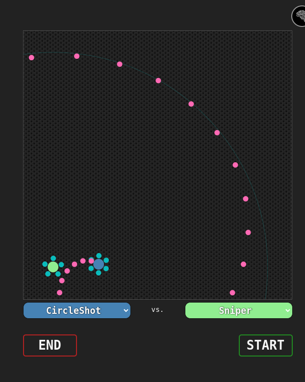

# Robo-Wars
Learn some JavaScript by creating a brain class for a battling robot!



## Dependencies

* None! (well, there's a code styling library that is used to explain the rules in the menu, but none for the game itself)


## Usage

```javascript
class CustomBrain {
        constructor() {
          this.name = "Bojangles";
          this.color = "purple";

          //**POWERS (must total < 5)**
          this.armor = 1;
          this.bulletPower = 0;
          this.scanDistance = 1;
          //***************************

          // your logic below should change these 2 variables
          this.decision = "shoot";
          this.shotAngle = 0;

          // you can add additional variables here if you want, but be sure not to overwrite any existing variables
        }

        /* 
        these calls are available any time and do NOT take the place of a decision
        
        this.scan();
        will either return:
        1. an object with the enemy's x and y (if an enemy is within the scan radius)
        2. an empty object (if no enemy within the radius)
        
        this.whereAmI();
        will return your x and y in an object (ex: {x: 25, y: 61})
        */
        // random integer generator
        randInt(min, max) {
          return Math.floor(Math.random() * (max - min + 1)) + min;
        }
        // the decide call gets made every time the game updates (e.g. every 100ms)
        decide() {
          if (this.randInt(0, 1) == 1) {
            this.shotAngle = 180;
          } else {
            this.shotAngle = 0;
          }
          // Your decision-making logic goes here (e.g., move left, shoot, etc.)
          return this.decision;
        }
      }
```

## Live View
https://leimapapa.github.io/robo-wars/

## Working Example
[codepen example](https://codepen.io/leimapapa/pen/QWJJgxW)
